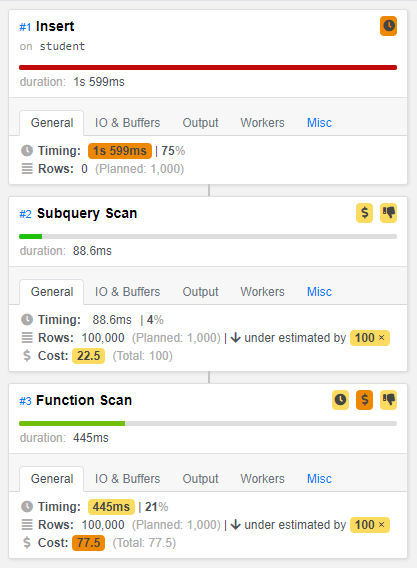
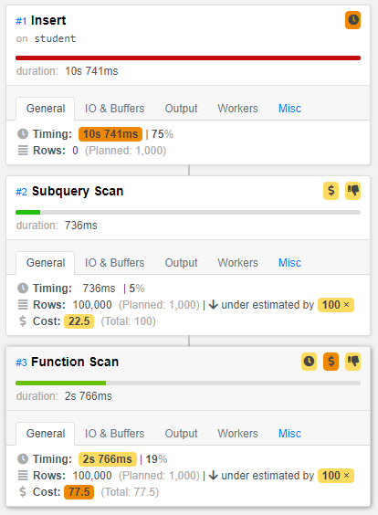
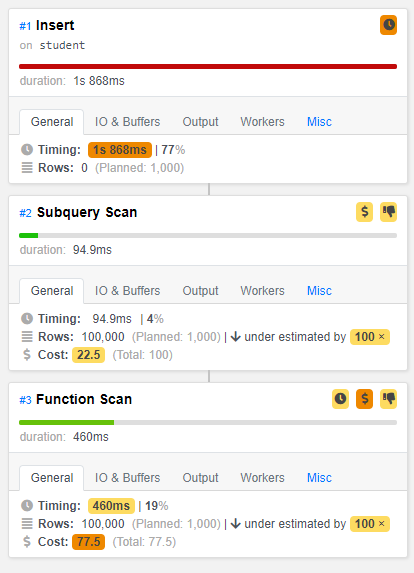

Insert without index
```sql
Insert on student  (cost=0.00..100.00 rows=1000 width=1572) (actual time=2132.549..2132.549 rows=0 loops=1)
"  ->  Subquery Scan on ""*SELECT*""  (cost=0.00..100.00 rows=1000 width=1572) (actual time=18.239..533.681 rows=100000 loops=1)"
->  Function Scan on generate_series s  (cost=0.00..77.50 rows=1000 width=108) (actual time=17.507..445.104 rows=100000 loops=1)
Planning time: 0.062 ms
Execution time: 2134.439 ms
```


Insert after btree index
```sql
Insert on student  (cost=0.00..100.00 rows=1000 width=1572) (actual time=14243.196..14243.197 rows=0 loops=1)
"  ->  Subquery Scan on ""*SELECT*""  (cost=0.00..100.00 rows=1000 width=1572) (actual time=12.694..3502.009 rows=100000 loops=1)"
->  Function Scan on generate_series s  (cost=0.00..77.50 rows=1000 width=108) (actual time=12.678..2765.804 rows=100000 loops=1)
Planning time: 0.065 ms
Execution time: 14246.571 ms
```


Insert after hash index
```sql
Insert on student  (cost=0.00..100.00 rows=1000 width=1572) (actual time=2423.104..2423.104 rows=0 loops=1)
"  ->  Subquery Scan on ""*SELECT*""  (cost=0.00..100.00 rows=1000 width=1572) (actual time=10.907..554.775 rows=100000 loops=1)"
        ->  Function Scan on generate_series s  (cost=0.00..77.50 rows=1000 width=108) (actual time=10.888..459.837 rows=100000 loops=1)
Planning time: 0.060 ms
Execution time: 2426.166 ms
```

